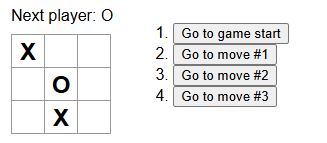

# React Workshop
14.05.2025
`git clone https://github.com/FunctionDJ/react-workshop.git`

### Ablauf + Links
1) Präsentation + Aufgaben pro Kapitel (~2h)
2) ein Spiel entwickeln
3) eine Anwendung entwickeln
4) Optional: Promises, ESLint, React DevTools, Context
* Diese Präsentation: `./docs/workshop.md`
* React Guides: https://react.dev/learn
* React Dokumentation: https://react.dev/reference
* JavaScript Guides: https://javascript.info/ (z.B. für `fetch`)

### 1.1 Out of Scope
* keine Component/Routing/State Management Libraries
* kein Next.js, SSR oder RSC
* keine TypeScript oder Styling Tools wie Tailwind
* außer wenn jemand fragt natürlich

### 1.2 Was ist React?
* React ist eine JavaScript Library zum Erstellen reaktiver/dynamischer User Interfaces in einem deklarativen Stil
* React ist auch ein modulares Frontend Ökosystem
* React wird meistens mit dem JSX Syntax (`.jsx`) benutzt, welcher zu JS compiled werden muss
* JSX wird außerhalb vom Browser compiled (Vite als Bundler mit Node.js als Runtime)
* React wird als JS from Browser ausgeführt
* Mit React können Single-Page-Applications gebaut werden
* React ist grundsätzlich sicher gegen XSS

### 1.3 Setup
1) Pakete installieren: `npm install`
2) Vite im Development Modus starten: `npm run dev`
3) Link aus dem Terminal öffnen

### 1.4 Komponenten
* wiederverwendbare Stücke von User Interface mit eigener Logik und eigenem Aussehen
* kann so klein wie ein Button oder groß wie eine ganze Seite sein
* sind JavaScript Funktionen, die ein JSX Element oder eine Komponente returnen
* wie in HTML können die meisten JSX Elemente Children haben (z.B. `<div>`)
* JSX Tags fangen mit einem Kleinbuchstaben und Komponenten mit einem Großbuchstaben an

---

```html
<!-- index.html -->
<html>
  <body>
    <div id="root"></div>
    <script src="main.jsx" type="module"></script>
  </body>
</html>
```
```jsx
// main.jsx
import { createRoot } from "react-dom/client";

function App() {
  return <p>Hello world!</p>;
}

createRoot(document.getElementById("root")).render(<App />);
```

* #### 💡 Aufgabe: App Komponente, die eine MyButton Komponente rendert

### 1.5 JSX
* strikter als HTML (Tags immer schließen)
* wenn man mehrere JSX Tags oder Komponenten nebeneinander returnen möchte, kann man sie mit `<>...</>` wrappen
* mit Curly Braces kann man von JSX zu JavaScript "escapen" und so JavaScript Werte anzeigen lassen oder als Attribute benutzen
* innerhalb von Curly Braces ist jede Expression erlaubt, z.B. String Concatenation oder Ternaries

---

- für CSS Klassen benutzt man `className` statt `class`
* es gibt verschiedene Libraries, die eigene Styling-Systeme implementieren
* `style={{ color: "blue" }}`
  * äußere `style={ ... }` 👉 Escape von JSX zu JavaScript
  * innere `{ color: "blue" }` 👉 JavaScript Objekt
  * für dynamische (variablen-abhängige) Styles gedacht
  * für "statische" Styles in Prod ungeeignet - für Prototyping okay
  * Variable + Einheit: `style={{ marginLeft: margin + "em"}}`
  * ohne Einheit = `px`: `style={{ padding: paddingVariable }}`

* #### 💡 Aufgabe: `` rendern mit `src,alt,style` Attributen basierend auf `ccImageData` Objekt

### 1.6 Conditional Rendering und Listen
* Conditional Rendering: Basiert auf JavaScript und hat keine eigenen Keywords
* if mit `&&`
* if-else als Ternary oder in Komponente extrahieren
* Listen rendern durch `.map`, auch keine eigenen Keywords außer `key`
* `key` ist ein in der Liste unique String oder Nummer (meistens Datenbank Id) und ist notwendige Optimierung

---

```jsx
const foo = true
const list = [1, 2, 3]

function MyComponent() {
  return (
    <>
      {foo && <span>Foo ist true</span>}
      {foo ? <span>Foo ist true</span> : <span>Foo ist false</span>}
      {list.map(elem => (
        <span key={elem}>{elem}</span>
      ))}
    </>
  )
}
```

* #### 💡 Aufgabe: Rendere das Array `ccList`, welches aus Objekten besteht, als `` mit `key`, `width` und `alt`
  * in der Browser Console sollten keine Fehler geloggt werden :)

### 1.7 Events
* Funktion an das `onClick` Attribut übergeben
* als Variable oder eine inline Arrow Function `onClick={(event) => {...}}`
* es gibt Attribute für alle möglichen Events: Maus Hover, Tastatur, Bild hat fertig geladen...

* #### 💡 Aufgabe: Einen Button erstellen, der beim Klick `window.alert("irgendwas")` ausführt

### 1.8 Hooks
* In React sind alle Funktionen, die mit `use` anfangen, Hooks
* eingebaute Hooks: `useState`, `useEffect`, `useContext`, `useRef`, alle Anderen weniger häufig
* man kann verwendete Hooks (ohne Komponenten-Markdown) wiederverwenden, indem man einen "custom Hook" schreibt (z.B. `useFetch`)
* Hooks müssen im Top-Level von Komponenten ohne Condition aufgerufen werden, also nicht in `if`, `else`, `for`, in Event Handlern, oder nach `if (...) { return }`

### 1.9 State / useState
* ähnlich zu Variablen, aber wenn State verändert wird, rendert React neu
* `useState` erhält den Initialwert und returnt ein Pärchen (Array) aus Variable und Updater-Funktion
* Konvention: `const [foo, setFoo] = useState(initialValue)`
* Beispiel Counter: `const [counter, setCounter] = useState(0)`
  * beim ersten Render hat `counter` den Wert `0`
  * wenn man `setCounter(counter + 1)` aufruft, wird die Komponente neu gerendert und `counter` hat den Wert `1`, `2`, ...
* Jede Instanz der Komponente hat ihren eigenen State

* #### 💡 Aufgabe: Erstelle eine `ButtonCounter` Komponente
  * `ButtonCounter` soll ein Button mit einer Zahl sein, die beim Klick auf den Button inkrementiert wird
  * `ButtonCounter` soll mindestens 2x verwendet werden (zwei separate Counter)

### 1.10 Daten zwischen Komponenten teilen

 

---

- Props sind Parameter für Komponenten
* werden übergeben wie Attribute `<SomeComponent foo={foo}/>`
* Props sind in der aufgerufenen Komponente/Funktion immer der erste Parameter (ein Objekt)
* Konvention: Object Destructuring `function MyComponent({ firstProp, secondProps }) { ... }`

* #### 💡 Aufgabe: Verändere die den vorherigen Code, sodass sich beide Counter den State teilen
  * zwei Instanzen von `ButtonCounter`, die immer die gleiche Zahl anzeigen und beim Klick diese inkrementieren

### 1.11 Effekte / useEffect
* Effekte sind ein "Schlüpfloch" zum Synchronisieren von React Komponenten mit externen Systemen
* Beispiele für externe Systeme
  * Anfragen über das Netzwerk (z.B. mit `fetch`), also jedes Backend
  * JavaScript, welches nicht zu React gehört
  * Manche andere Browser APIs
* `useEffect` ist eine Art Lifecycle System
  * Kann eine Funktion ausführen, wenn die Komponente gemountet wird, unmounted wird, oder sich Variablen ändern
* `useEffect` wird oft falsch benutzt
  * z.B. für imperative Änderungen, die eigentlich deklarativ ausgedrückt werden sollten
  * hat die meisten "Caveats" aller häufig genutzten Features von React
  * https://react.dev/learn/you-might-not-need-an-effect
  * wird häufig mit Libraries abstrahiert, z.B. `react-query`

---

```js
import { useState, useEffect } from 'react';
import { createConnection } from './chat.js';

function ChatRoom({ roomId }) {
  const [serverUrl, setServerUrl] = useState('https://localhost:1234');

  useEffect(() => {
    const connection = createConnection(serverUrl, roomId);
    connection.connect();
    return () => {
      connection.disconnect();
    };
  }, [serverUrl, roomId]);
  // ...
}
```

---

#### 💡 Aufgabe 1: Schreibe einen `useFetchPokemon` Custom Hook
  * erhält String (Pokemon) als Parameter (z.B. `ditto`, `pikachu`, `bulbasaur`)
  * lädt die Pokemon Daten von `https://pokeapi.co/api/v2/pokemon/[pokemonName]` mit `fetch`
  * hat State für die Sprite URL (in der JSON Response: `sprites.front_default`, ist ein String)
  * returnt diesen State
  * diese Strings sollen per `` gerendert werden

    ```jsx
    const dittoImageURL = useFetchPokemon("ditto")
    const pikachuImageURL = useFetchPokemon("pikachu")
    const bulbasaurImageURL = useFetchPokemon("bulbasaur")
    ```

---

#### 💡 Aufgabe 2: Pokemon per Button
  * nur 1 `` Tag
  * Auswahl, welches Pokemon angezeigt werden soll, aus 3 unterschiedlichen Möglichkeiten
  * ohne Conditional Rendering
  * ohne Fehler in der Browser Konsole

### 2. Gaming

* 
* Tic Tac Toe Regeln
  * 2 Spieler, X und O
  * wechseln sich ab, X beginnt
  * wer zuerst 3 in einer Reihe, Spalte, oder Diagonalen hat, gewinnt
  * wenn jemand gewonnen hat, sind keine weiteren Züge erlaubt
* Historie
  * Man kann einen Zug in der Historie auswählen und von dort weiterspielen, in dem Fall werden alle späteren Züge verworfen (geht auch nach dem Gewinn)
* Anzeige, wer am Zug ist und ggf. wer gewonnen hat
* Referenz-Implementierung & Guide: https://react.dev/learn/tutorial-tic-tac-toe

### 3. Todo App

1) erstellen, auflisten, ändern, löschen ("CRUD")
2) wie sollen todo-items geupdated werden? mit delay? beim "unfokussieren"? button? enter-taste?
3) lade zustände, fehler zustände
4) toast notification über erfolg/fehler
5) suche/filter
* Beispiel-Lösung im Wiki: *Weiterbildung / React Workshop*

### 4. Ihr seid zu schnell, ich hab keine Folien mehr

Optional: Promises, ESLint, React DevTools, Context
